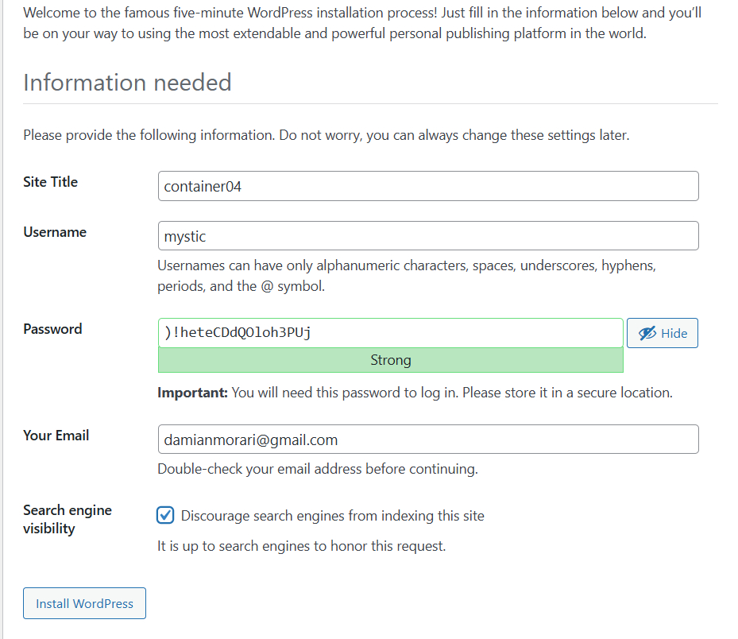
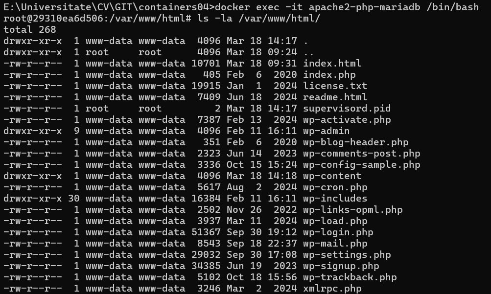
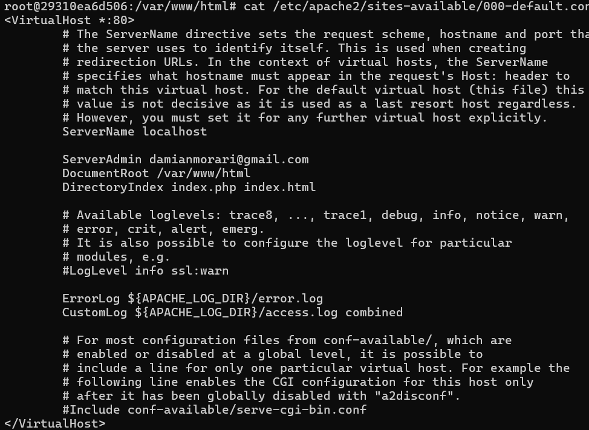
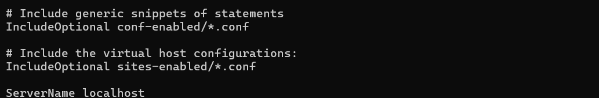
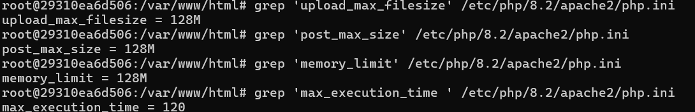
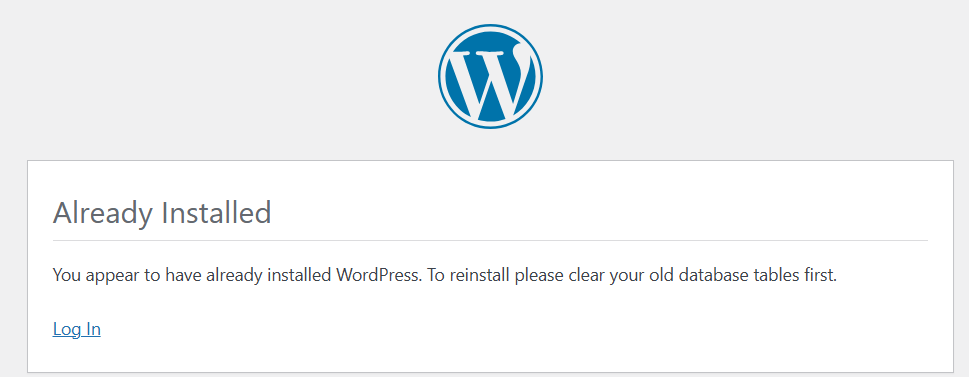
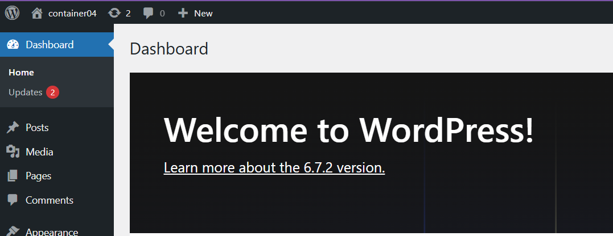

# Prima aplicatie Docker

## Scopul:  Pregatirea unui container pentru a rula un site web bazat pe Apache HTTP Server + PHP (mod_php) + MariaDB

### Sarcina propusa: Sa cream un fișier Dockerfile pentru a construi o imagine a containerului care va conține un site web bazat pe Apache HTTP Server + PHP (mod_php) + MariaDB. Baza de date MariaDB trebuie să fie stocata intr-un volum montat. Serverul trebuie să fie disponibil pe portul 8000. Instalam site-ul WordPress. Verificam functionarea site-ului

### Mod de lucru

1. Am creat in directorul containers04 un director files, precum si

- directorul files/apache2 - pentru fisierele de configurare apache2;

- directorul files/php - pentru fisierele de configurare php;

- directorul files/mariadb - pentru fisierele de configurare mariadb

2.Cream un dockerfile din care vom crea o imagine. Fisierul va avea urmatorul continut:

```shell
# create from debian image
FROM debian:latest

# install apache2, php, mod_php for apache2, php-mysql and mariadb
RUN apt-get update && \
    apt-get install -y apache2 php libapache2-mod-php php-mysql mariadb-server && \
    apt-get clean
```

3.Construim o imagine a containerului cu numele *apache2-php-mariadb* prin comanda:

```shell
docker build -t apache2-php-mariadb .
```

4.Construim un container pe baza imaginii care va fi pornit pe fundal cu comanda bash cu aceasta comanda:

```shell
docker run -d --name apache2-php-mariadb apache2-php-mariadb bash
```

6.Copiem din container fisierele de configurare apache2, php, mariadb în directorul files/ de pe computer prin aceste comenzi:

```shell
docker cp apache2-php-mariadb:/etc/apache2/sites-available/000-default.conf files/apache2/
docker cp apache2-php-mariadb:/etc/apache2/apache2.conf files/apache2/
docker cp apache2-php-mariadb:/etc/php/8.2/apache2/php.ini files/php/
docker cp apache2-php-mariadb:/etc/mysql/mariadb.conf.d/50-server.cnf files/mariadb/
```

7.Configurarea fisierelor apache2

- Deschidem fisierul *files/apache2/000-default.conf*, gasim linia *#ServerName [www.example.com](www.example.com)* si inlocuim cu *ServerName localhost*

- Gasim linia *ServerAdmin webmaster@localhost* si inlocuim adresa de e-mail cu a noastra personala

- Dupa linia DocumentRoot /var/www/html adaugam urmatoarea linie:

```shell
DirectoryIndex index.php index.html
```

- Salvam si inchidem fisierul

- La sfarsitul fisierului files/apache2/apache2.conf adaugam urmatoarea linie:

```shell
ServerName localhost
```

8.Configurarea fisierului PHP

- Deschidem fisierul files/php/php.ini, gasim linia *;error_log = php_errors.log* si inlocuim cu *error_log = /var/log/php_errors.log*

- Setați parametrii memory_limit, upload_max_filesize, post_max_size și max_execution_time astfel:

memory_limit = 128M\
upload_max_filesize = 128M\
post_max_size = 128M\
max_execution_time = 120\

- Salvam fisierul si inchidem

9.Configurarea fisierului MariaDB

- Deschidem fisierul *files/mariadb/50-server.cnf*, gasim linia *#log_error = /var/log/mysql/error.log* si eliminam # din fața ei

- Salvați fișierul și închideți-l

10.Crearea scriptului de pornire

- In directorul files cream directorul supervisor si fisierul supervisord.conf cu urmatorul continut:

```shell
[supervisord]
nodaemon=true
logfile=/dev/null
user=root

# apache2
[program:apache2]
command=/usr/sbin/apache2ctl -D FOREGROUND
autostart=true
autorestart=true
startretries=3
stderr_logfile=/proc/self/fd/2
user=root

# mariadb
[program:mariadb]
command=/usr/sbin/mariadbd --user=mysql
autostart=true
autorestart=true
startretries=3
stderr_logfile=/proc/self/fd/2
user=mysql
```

11.Completarea fisierului dockerfile pana il aducem la forma asta

```shell
FROM debian:latest

# mount volumes for mysql data and logs
VOLUME /var/lib/mysql
VOLUME /var/log

RUN apt-get update && \
    apt-get install -y supervisor apache2 php libapache2-mod-php php-mysql mariadb-server curl && \
    apt-get clean

# download and extract wordpress
WORKDIR /var/www/html
RUN curl -o /tmp/latest.tar.gz https://wordpress.org/latest.tar.gz && \
    tar -xzf /tmp/latest.tar.gz --strip-components=1 && \
    rm /tmp/latest.tar.gz && \
    chown -R www-data:www-data /var/www/html

# copy apache2 configuration files
COPY files/apache2/000-default.conf /etc/apache2/sites-available/000-default.conf
COPY files/apache2/apache2.conf /etc/apache2/apache2.conf

# copy php configuration file
COPY files/php/php.ini /etc/php/8.2/apache2/php.ini

# copy mysql configuration file
COPY files/mariadb/50-server.cnf /etc/mysql/mariadb.conf.d/50-server.cnf

# copy supervisor configuration file
COPY files/supervisor/supervisord.conf /etc/supervisor/supervisord.conf

# create mysql socket directory
RUN mkdir /var/run/mysqld && chown mysql:mysql /var/run/mysqld

EXPOSE 80

CMD ["/usr/bin/supervisord", "-n", "-c", "/etc/supervisor/supervisord.conf"]
```

12.Crearea din nou a imaginii cu comanda de data trecuta

13.Stergem containerul *apache2-php-mariadb* si cream altul cu acelasi nume utilizand comenzile:

```shell
docker rm apache2-php-mariadb
docker run -d --name apache2-php-mariadb -p 80:80 apache2-php-mariadb
```

*Remarca:* Verificand fisierul de loguri putem vedea unele probleme din cauza a catorva directoare care nu sa-u creat. Rezolvam asta cu urmatoarele comenzi introduse in Docker Desktop in compartimentul Exec sau in linia de comanda folosind urmatoarele comenzi consecutiv:

```shell
docker exec -it apache2-php-mariadb bash
mkdir -p /var/log/supervisor && touch /var/log/supervisor/supervisord.log && chown -R root:root /var/log/supervisor && chmod -R 755 /var/log/supervisor 
mkdir -p /var/log/mysql && touch /var/log/mysql/error.log && chown mysql:mysql /var/log/mysql/error.log
```

14.Intram pe localhost si vedem ca putem instala site-ul Wordpress.

- Cream BD prin urmatoarele comenzi in linia de comanda a containerului sau in Exec la Docker Desktop

```sql
mysql
CREATE DATABASE wordpress;
CREATE USER 'wordpress'@'localhost' IDENTIFIED BY 'wordpress';
GRANT ALL PRIVILEGES ON wordpress.* TO 'wordpress'@'localhost';
FLUSH PRIVILEGES;
EXIT;
```

- Incepem instalare Wordpress. Introducem datele necesare
*La pasul 2, specificam următoarele date:*
- Numele bazei de date: wordpress;
- Utilizatorul bazei de date: wordpress;
- Parola bazei de date: wordpress;
- Adresa bazei de date: localhost;
- Prefixul tabelelor: wp_.



- Verificam prezenta fisierelor Wordpress



- Verificam daca s-au schimbat fisierele de configurare Apache2, PHP, MariaDB si in container







15.Copiem fisierul wp-config.php in directorul files de la noi de pe calculator prin comanda:

```shell
docker cp apache2-php-mariadb:/var/www/html/wp-config.php ./files/wp-config.php 
```

16.Adaugam in dockerfile urmatoarea comanda (la crearea imaginii in container se va copia si fisierul wp-config in directorul html):

```shell
# copy the configuration file for wordpress from files/ directory
COPY files/wp-config.php /var/www/html/wordpress/wp-config.php
```

17.Recream imaginea, cream un nou container montand volumul cu BD si cu loguri, dar inainte de asta stergem containerul existent:

```shell
docker rm apache2-php-mariadb
docekr build -t apache2-php-mariadb .
docker run -d --name apache2-php-mariadb -p 80:80 -v mariadb_data:/var/lib/mysql -v mariadb_logs:/var/log apache2-php-mariadb
```

18.Pornim in browser localhost si observam



19.Efectuam LogIn in site cu datele introduse inca la instalare



- Montand volumul cu BD am reusit sa salvam tabelul cu baza de date si la crearea repetata a containerului am primit acces la acelasi cont de pe Wordpress fara sa fie nevoie de a instala iar, deoarece am copiat fisierul wp-config.php in noul container

### Intrebari

1.Ce fișiere de configurare au fost modificate?

- Au fost modificate fisierele de configurare Apache2(apache2.conf si 000-default.conf), PHP (php.ini) si MariaDB(50-server.cnf)

2.Pentru ce este responsabilă instrucția DirectoryIndex din fișierul de configurare apache2?

- Defineste fisierul/fisierelel implicit pe care Apache il deschinde atunci când se accesează un director (in cazul nostru: index.php, index.html)

3.De ce este necesar fișierul wp-config.php?

- Contine configurarile de baza ale site-ului impreuna cu informatia de conectare catre baza de date

4.Pentru ce este responsabil parametrul post_max_size din fișierul de configurare php?

- Indica fluxul maxim de MB de informatie care poate fi transmis prin metoda POST din PHP

5.Specificați, în opinia dvs., care sunt deficiențele imaginii containerului creat?

- Baza de date se pierde la recrearea imaginii si containerului daca nu setam volumul (parametrul -v)

- Dimensiunea imaginii e prea mare pentru un functional limitat care avem

- Lipsa unui sistem de salvare a datelor automat, trebuie mereu facut asta manual

## Concluzie

In aceasta lucrare am construit un container Docker ce ruleaza un site web WordPress pe Apache HTTP Server cu PHP si MariaDB. Am configurat serverul, PHP si baza de date, montand volume pentru persistenta datelor. Site-ul este disponibil pe portul 80 si permite accesul repetat fara reinstalare, datorita volumului pentru baza de date si configurarii wp-config.php
